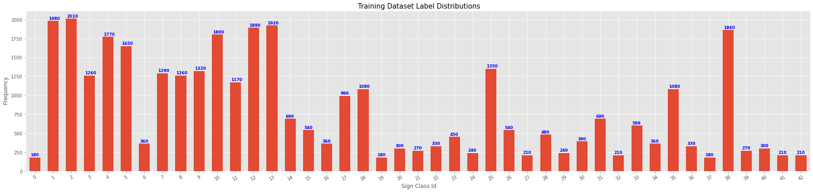
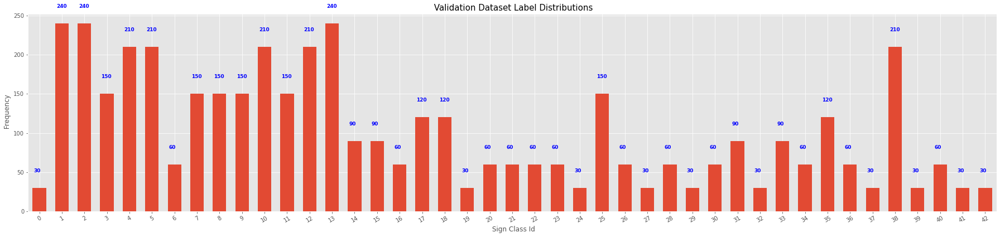
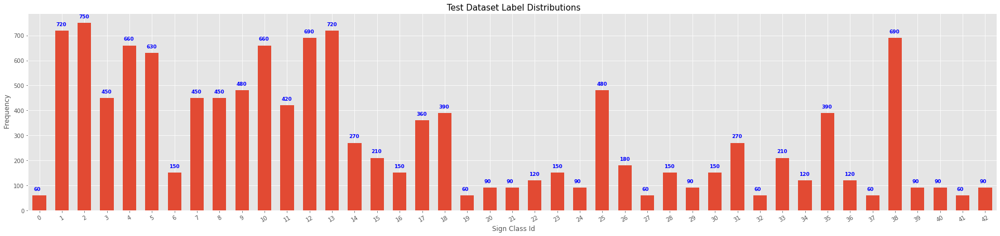
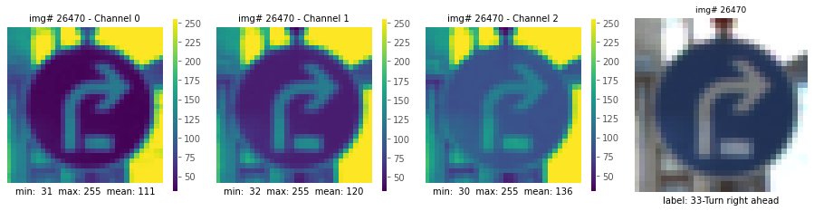
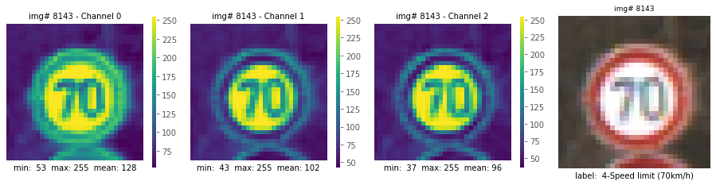
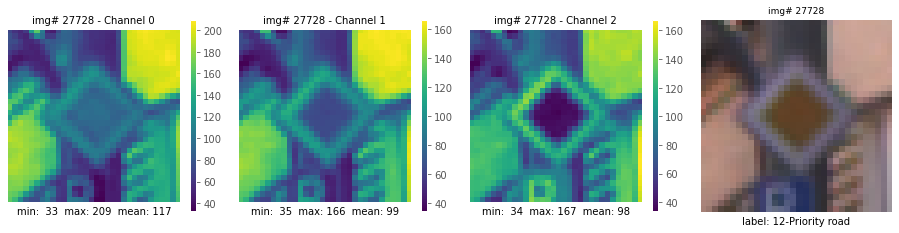

# **Traffic Sign Recognition** 
### Project 2 - Udacity Self Driving Car Nanodegree 
#### Kevin Bardool
---

#### Project Goals:


* Load the data set (see below for links to the project data set)
* Explore, summarize and visualize the data set
* Design, train and test a model architecture
* Use the model to make predictions on new images
* Analyze the softmax probabilities of the new images
* Summarize the results with a written report

---
#### Contents:
This writeup addresses the project specifications/requirements as laid out in the [Rubric Points](https://review.udacity.com/#!/rubrics/481/view) :


* [Dataset Exploration ](#1-Dataset-Summary-&-Exploration) 
* [Model Design and Traning : ](#2.-Model-Architecture-Design-and-Test) Review of the detection pipeline for images 
* [Inference : ](#3.-Test-a-Model-on-New-Images)Review of the detection pipeline for videos 
* [Discussion : ](#4-discussion) Reflection on work, challenges encountered, and  possible improvements.
* [Appendix : ](#appendicies) Contains supplementary information.


[//]: # (Image References)

[image1]: ./examples/visualization.jpg "Visualization"
[image2]: ./examples/grayscale.jpg "Grayscaling"
[image3]: ./examples/random_noise.jpg "Random Noise"
[image4]: ./examples/placeholder.png "Traffic Sign 1"
[image5]: ./examples/placeholder.png "Traffic Sign 2"
[image6]: ./examples/placeholder.png "Traffic Sign 3"
[image7]: ./examples/placeholder.png "Traffic Sign 4"
[image8]: ./examples/placeholder.png "Traffic Sign 5"


---

Link to my [project code](https://github.com/kbardool/CarND-Traffic-Sign-Classifier-Project/blob/master/Traffic_Sign_Classifier.ipynb)

## 1. Dataset Summary & Exploration

#### 1.1 Provide a basic summary of the data set. In the code, the analysis should be done using python, numpy and/or pandas methods rather than hardcoding results manually.

I used the pandas library to calculate summary statistics of the traffic
signs data set:

* The size of training set is ?
* The size of the validation set is ?
* The size of test set is ?
* The shape of a traffic sign image is ?
* The number of unique classes/labels in the data set is ?

```python

 Number of unique labels : 43 
 Labels: [0, 1, 2, 3, 4, 5, 6, 7, 8, 9, 10, 11, 12, 13, 14, 15, 16, 17, 18, 19, 20, 21, 22, 23, 24, 25, 26, 27, 28, 29, 30, 31, 32, 33, 34, 35, 36, 37, 38, 39, 40, 41, 42] 

 Number of training examples .......  34799
 Number of validation examples .....  4410
 Number of testing examples ........  12630
 Image data shape ..................  (32, 32, 3)
 Number of classes .................  43


   Id    Sign description                                        Id    Sign description               
  ----   -------------------------------                        ----   -------------------------------
    0    Speed limit (20km/h)                              	 22    Bumpy road        
    1    Speed limit (30km/h)                         		 23    Slippery road                                                           
    2    Speed limit (50km/h)                         		 24    Road narrows on the right                    
    3    Speed limit (60km/h)                         		 25    Road work                                    
    4    Speed limit (70km/h)                         		 26    Traffic signals                              
    5    Speed limit (80km/h)                         		 27    Pedestrians                                  
    6    End of speed limit (80km/h)                  		 28    Children crossing                            
    7    Speed limit (100km/h)                        		 29    Bicycles crossing                            
    8    Speed limit (120km/h)                        		 30    Beware of ice/snow                           
    9    No passing                                   		 31    Wild animals crossing                        
    10    No passing for vehicles over 3.5 metric tons 		 32    End of all speed and passing limits          
    11    Right-of-way at the next intersection        		 33    Turn right ahead                             
    12    Priority road                                		 34    Turn left ahead                              
    13    Yield                                        		 35    Ahead only                                   
    14    Stop                                         		 36    Go straight or right                         
    15    No vehicles                                  		 37    Go straight or left                          
    16    Vehicles over 3.5 metric tons prohibited     		 38    Keep right                                   
    17    No entry                                     		 39    Keep left                                    
    18    General caution                              		 40    Roundabout mandatory                         
    19    Dangerous curve to the left                  		 41    End of no passing                            
    20    Dangerous curve to the right                 		 42    End of no passing by vehicles over 3.5 metric tons
    21    Double curve                                 		 --------------------
```
#### 1.2 Include an exploratory visualization of the dataset.

Here is an exploratory visualization of the data set. It is a bar chart showing how the data ...

<!-- ![alt text][image1] -->

<figure>

<p align="center">&nbsp &nbsp  Training Dataset Class Distribution<br> &nbsp</p>

<p align="center">&nbsp &nbsp  Validation Dataset Class Distribution<br> &nbsp</p>

<p align="center">&nbsp &nbsp  Test Dataset Class Distribution<br> &nbsp</p>
</figure>
<br>


<figure>



<p align="center">&nbsp &nbsp  Sample Images <br> &nbsp</p>
</figure>
<br>


## 2. Data Preprocessing 

#### 2.1 Describe how you preprocessed the image data. What techniques were chosen and why did you choose these techniques? Consider including images showing the output of each preprocessing technique.Pre-processing refers to techniques such as converting to grayscale, normalization, etc. 

**(OPTIONAL: As described in the "Stand Out Suggestions" part of the rubric, if you generated additional data for training, describe why you decided to generate additional data, how you generated the data, and provide example images of the additional data. Then describe the characteristics of the augmented training set like number of images in the set, number of images for each class, etc.)**

As a first step, I decided to convert the images to grayscale because ...

Here is an example of a traffic sign image before and after grayscaling.


As a last step, I normalized the image data because ...

I decided to generate additional data because ... 

To add more data to the the data set, I used the following techniques because ... 

Here is an example of an original image and an augmented image:

<figure>

<p align="center">&nbsp &nbsp  Augmentation Example - Original Images<br> &nbsp</p>

<p align="center">&nbsp &nbsp  Image Augmentation - Images after random augmentation</p>
</figure>
<br>
<br>

![alt text][image3]

The difference between the original data set and the augmented data set is the following ... 

## 3. Model Architecture Design and Test 

I selected to start with the relatively simple LeNet model as a baseline template. There were two main reasons behind this selection. First,  was the fact that the input data is relatively simple (32 x 32 x 3); a larger, more sophisticated model could easily overfit the training data. Second, I intended to study the effects of various adjustments in the architecture on various aspects of model training and final model accuracy.  

We name the baseline architecture Arch1. Subsequent architectures are named Arch2, Arch3, etc...A table listing all the various model configurations along with their corresponding parameters is listed in the following table:

| Layer               | Filter | Stride | Arch1|  A2  |  A3  |  A4  |  A5  |  A6  |  A7  | Output Shape     | 
|:-------------------:|:------:|:------:|:----:|:----:|:----:|:----:|:----:|:----:|:----:|:----------------:|
| Conv Layer 1 5x5 	  | 5 x 5  |    1   |   6  | 16   |  6   |  16  |  32  |  16  |  32  | 28x28 x #filters |
| MaxPool 1           | 2 x 2  |    2   |      |      |      |      |      |      |      | 14x14 x #filters |
| Conv Layer 2 5x5    | 5 x 5  |    1   | 16   |  16  | 10   |  16  |  16  |  32  |  32  | 10x10 x #filters |
| MaxPool 2           | 2 x 2  |    2   |      |      |      |      |      |      |      |  5x5  x #filters |
| MaxPool 2 Flattened |    -   |    -   | 400  | 400  | 250  | 400  | 400  | 800  | 800  |                  |
| FC 1		          |    -   |    -   | 120  | 240  | 120  | 240  | 240  | 240  | 240  |                  | 
| FC 2		          |    -   |    -   | 120  | 120  |  80  | 240  | 240  | 240  | 240  |                  | 
| FC 3 (Logits)       |    -   |    -   | 43   | 43   | 43   | 43   | 43   | 43   | 43   |                  | 


#### 3.1 Describe what your final model architecture looks like including model type, layers, layer sizes, connectivity, etc.) Consider including a diagram and/or table describing the final model.

My final model consisted of the following layers:


| Layer         		  |  A4  |  A5  |  A6  |  A7  | output         |    		
|:-----------------------:|:----:|:----:|:----:|:----:|:--------------:|
| Conv Layer 1 5x5 	      |  16  |  32  |  16  |  32  | 28x28 x #filters |
| Max pooling 1  2x2	  |      |      |      |      | 14x14 x #filters |
| Conv Layer 2 5x5        |  16  |  16  |  32  |  32  | 10x10 x #filters |
| RELU                 	  |      |      |      |      |                |
| Max Pooling 2  2x2      | 2x2  | 2x2  | 2x2  | 2x2  |  5x5 x #filters |
| Flattened from MaxPool2 | 400  | 400  | 800  | 800  |
| FC 1		              | 240  | 240  | 240  | 240  |                | 
| Dropout 1				  | 0.5  | 0.5  | 0.5  | 0.5  |                |	
| FC 2		              | 240  | 240  | 240  | 240  |                | 
| Dropout 2				  | 0.5  | 0.5  | 0.5  | 0.5  |                |	
| FC 3 (Logits)           | 43   | 43   | 43   | 43   |                | 
 
 
#### Data Augmentation
[Data Augmentation](https://www.pyimagesearch.com/2019/07/08/keras-imagedatagenerator-and-data-augmentation/)

#### 2.3 Describe how you trained your model. The discussion can include the type of optimizer, the batch size, number of epochs and any hyperparameters such as learning rate.

For model training I implemented the function `run_training()`  (`common/model.py`, lines 12-200). We pass the data to this function:

* Training and validation data augmentation flows, `trn_datagen_flow, vld_datagen_flow`
* The network configuration information `mdl_config`
* structure for saving training metrics `results[]`
* `batch_size`, `learning_rate`, and number of `epochs` hyper-parameters
* Number of training and validation batches per  epoch, `trn_bpe` and `val_bpe`
* Indicator determining to start training fresh, or resume training from a previously taken checkpoint `reload`.
* model checkpoint to use from resuming training `load_ckpt`.

We define a standard training schedule for training all architectures:

| epochs  	          |    200    |     100    |     100    |    100    | 
|:-------------------:|:---------:|:----------:|:----------:|:---------:| 
| **learning rate**   | **0.001** | **0.0005** | **0.0002** | **0.0001**|      


#### 2.4 Describe the approach taken for finding a solution and getting the validation set accuracy to be at least 0.93. Include in the discussion the results on the training, validation and test sets and where in the code these were calculated. 
**Your approach may have been an iterative process, in which case, outline the steps you took to get to the final solution and why you chose those steps. Perhaps your solution involved an already well known implementation or architecture. In this case, discuss why you think the architecture is suitable for the current problem.**

My final model results were:
* training set accuracy of ?
* validation set accuracy of ? 
* test set accuracy of ?

If an iterative approach was chosen:
* What was the first architecture that was tried and why was it chosen?
* What were some problems with the initial architecture?
* How was the architecture adjusted and why was it adjusted? Typical adjustments could include choosing a different model architecture, adding or taking away layers (pooling, dropout, convolution, etc), using an activation function or changing the activation function. One common justification for adjusting an architecture would be due to overfitting or underfitting. A high accuracy on the training set but low accuracy on the validation set indicates over fitting; a low accuracy on both sets indicates under fitting.
* Which parameters were tuned? How were they adjusted and why?
* What are some of the important design choices and why were they chosen? For example, why might a convolution layer work well with this problem? How might a dropout layer help with creating a successful model?

If a well known architecture was chosen:
* What architecture was chosen?
* Why did you believe it would be relevant to the traffic sign application?
* How does the final model's accuracy on the training, validation and test set provide evidence that the model is working well?
 

## 3. Test a Model on New Images

#### 1. Choose five German traffic signs found on the web and provide them in the report. For each image, discuss what quality or qualities might be difficult to classify.

Here are five German traffic signs that I found on the web:

![alt text][image4] ![alt text][image5] ![alt text][image6] 
![alt text][image7] ![alt text][image8]

The first image might be difficult to classify because ...

#### 2. Discuss the model's predictions on these new traffic signs and compare the results to predicting on the test set. At a minimum, discuss what the predictions were, the accuracy on these new predictions, and compare the accuracy to the accuracy on the test set (OPTIONAL: Discuss the results in more detail as described in the "Stand Out Suggestions" part of the rubric).

Here are the results of the prediction:

| Image			        |     Prediction	        					| 
|:---------------------:|:---------------------------------------------:| 
| Stop Sign      		| Stop sign   									| 
| U-turn     			| U-turn 										|
| Yield					| Yield											|
| 100 km/h	      		| Bumpy Road					 				|
| Slippery Road			| Slippery Road      							|


The model was able to correctly guess 4 of the 5 traffic signs, which gives an accuracy of 80%. This compares favorably to the accuracy on the test set of ...

#### 3. Describe how certain the model is when predicting on each of the five new images by looking at the softmax probabilities for each prediction. Provide the top 5 softmax probabilities for each image along with the sign type of each probability. (OPTIONAL: as described in the "Stand Out Suggestions" part of the rubric, visualizations can also be provided such as bar charts)

The code for making predictions on my final model is located in the 11th cell of the Ipython notebook.

For the first image, the model is relatively sure that this is a stop sign (probability of 0.6), and the image does contain a stop sign. The top five soft max probabilities were

| Probability         	|     Prediction	        					| 
|:---------------------:|:---------------------------------------------:| 
| .60         			| Stop sign   									| 
| .20     				| U-turn 										|
| .05					| Yield											|
| .04	      			| Bumpy Road					 				|
| .01				    | Slippery Road      							|


For the second image ... 

### (Optional) Visualizing the Neural Network (See Step 4 of the Ipython notebook for more details)
#### 1. Discuss the visual output of your trained network's feature maps. What characteristics did the neural network use to make classifications?


